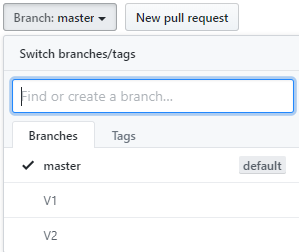

# LoginTemplate
A simple HTML template to help get you to get started with designing your Panther Web Login screen. Below is the screenshot of the completed Login screen in the Brower.  Most of the HTML  and js was generated by the Panther Migration Utility. Bootstrap libraries were used to transform the plan screen into a modern, responsive screen.  JPL validation and SQL functionality remain the same. Some of the JPL was rewritten in Javascript.

# What this repository contains
This repository contains two branches ; LoginTemplateV1 and LoginTemplateV2. LoginTemplateV1 is based on a simple Bootstrap 3 and LoginTemplateV2 is based on Bootstrap 4. Switch branches to view/download  details.
To access each branch,  click "Branches" on the above table head which will be present on the left.

Need a Panther Web 552 Redhat Image? [Click Here](https://hub.docker.com/r/prolificspanther/pantherweb)

[Click Here](https://www.prolifics.com/panther-trial-license-request) for a 45 day license.

How to setup a Panther Servlet Web Application? [Click Here](https://github.com/ProlificsPanther/PantherWeb/releases)
