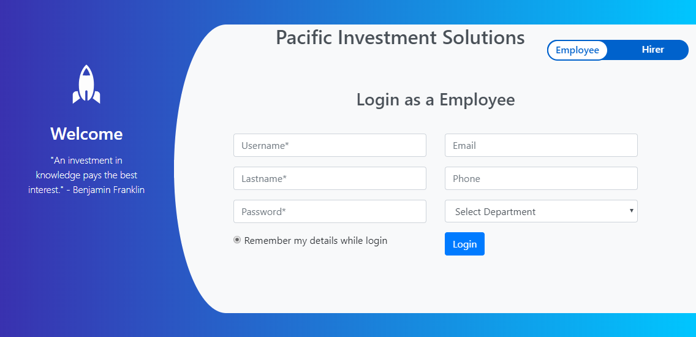

# LoginTemplate
A simple HTML template to help get you to get started with designing your Panther Web Login screen. Below is the screenshot of the completed Login screen in the Brower.  Most of the HTML  and js was generated by the Panther Migration Utility. Bootstrap libraries were used to transform the plan screen into a modern, responsive screen.  JPL validation and SQL functionality remain the same. Some of the JPL was rewritten in Javascript.

# What this repository contains
This repository contains two branches ; LoginTemplate1 and LoginTemplate2. LoginTemplate1 is based on a simple Bootstrap 3 and LoginTemplate2 is based on Bootstrap 4. Switch branches to view/download details.To access each branch,  click the  "Branch"  pulldown menu on the upper left corner.

Template1

Template2

       
Need a Panther Web 552 Redhat Image? [Click Here](https://hub.docker.com/r/prolificspanther/pantherweb "Named link title") 

How to set up a Panther Servlet Web Application? [Click Here](https://github.com/ProlificsPanther/PantherWeb/releases "Named link title")

Read our Documentation [here](https://docs.prolifics.com)
