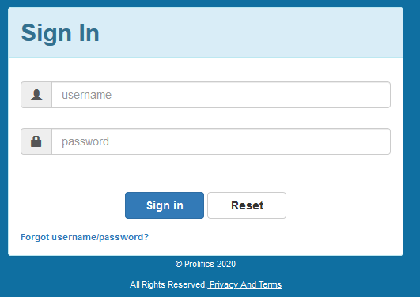

# LoginTemplate
A simple HTML template to help get you to get started with designing your Panther Web Login screen. Below is the screenshot of the completed Login screen in the Brower.  Most of the HTML  and js was generated by the Panther Migration Utility. Bootstrap libraries were used to transform the plan screen into a modern, responsive screen.  JPL validation and SQL functionality remain the same. Some of the JPL was rewritten in Javascript.
See screenshot of the Login screen, click on login.png.

# Prerequisites
  * Panther Web 5.5*
    
# This repository consists of 3 files
  * Panther screen name login
  * hr_login.html
  * hr_login.js
  
# Login screen
Panther  login  screen  contains username and password fields

# Hr_login.html
HTML template  is attached to the Panther Login screen via property  WEB OPTION->HTML OPTIONs->HTML Template .

# Hr_login.js
Javascript file contains requirements like the message alerts, hidden button clicks, validations for authentication etc.

Need a Panther Web 552 Redhat Image? [Click Here](https://hub.docker.com/r/prolificspanther/pantherweb)

[Click Here](https://www.prolifics.com/panther-trial-license-request) for a 45-day license.

How to set up a Panther Servlet Web Application? [Click Here](https://github.com/ProlificsPanther/PantherWeb/releases)
